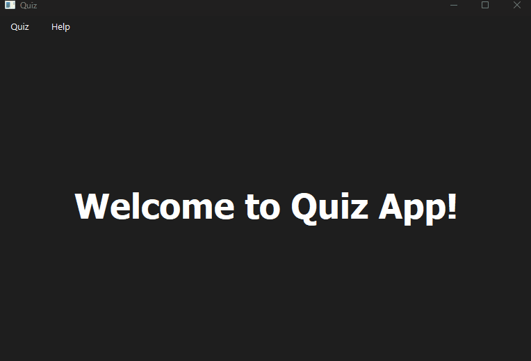

# 🎯 Quiz App


A simple quiz application built in Python with a PySide6 GUI.

## 🚀 Table of contents
- [🎯 Quiz App](#-quiz-app)
  - [🚀 Table of contents](#-table-of-contents)
  - [✨ Features](#-features)
  - [🎬 Demo](#-demo)
  - [📘 About the project](#-about-the-project)
  - [🔄 Application data flow](#-application-data-flow)
  - [🛠️ Technical highlights](#️-technical-highlights)
  - [🧠 What I learned](#-what-i-learned)
  - [📋 Requirements](#-requirements)
  - [⚙️ Installation](#️-installation)
      - [💻 Windows PowerShell](#-windows-powershell)
  - [🔧 Configuration](#-configuration)
      - [💻 Logging level in Windows PowerShell](#-logging-level-in-windows-powershell)
  - [▶️ Running app](#️-running-app)
  - [🗂️ Project structure](#️-project-structure)
  - [📌 Project status](#-project-status)
  - [🚧 Known limitations](#-known-limitations)
  - [🛣 Roadmap](#-roadmap)
    - [✅ Completed](#-completed)
    - [📝 Planned](#-planned)
  - [🧪 Tests](#-tests)
      - [💻 Running tests in Windows PowerShell](#-running-tests-in-windows-powershell)
  - [⚠️ Error triggers](#️-error-triggers)
    - [🚨 Error Trigger Table](#-error-trigger-table)
  - [📄 License](#-license)
  - [👤 Author contact](#-author-contact)
  - [⭐ Support](#-support)

## ✨ Features
- GUI built with PySide6
- Threaded question loading from the Open Trivia Database API
- Selectable number of questions, category, difficulty and question type
- Score calculation based on question difficulty
- Visual feedback based on the user's answer
- Loading overlay while questions are being fetched
- Error overlay with user-facing error messages
- Visual feedback when a particular question parameter causes an error
- Per-session file logging

## 🎬 Demo
Additional widget screenshots are available in the [widget presentation](docs/images/widget-presentation.md).



## 📘 About the project
This project was created as a learning exercise and my first complete desktop GUI application in Python.

It started as a simple console quiz made during a Python course. Later, I expanded it with a graphical interface, API integration, logging, error handling, stylesheets, type hints and a cleaner project structure.

The application allows selecting up to 100 questions, even though the Open Trivia Database API documentation states that up to 50 questions can be requested at once. This is intentional and is used to trigger error handling paths.

## 🔄 Application data flow
The application data flow and module structure are described in [docs/application-data-flow.md](docs/application-data-flow.md).

## 🛠️ Technical highlights
- PySide6 desktop GUI with multiple application screens
- Background question loading handled with QThread and Qt signals
- OpenTDB API client with timeout handling and custom exceptions
- Unit tests covering API responses, error handling and question model behavior
- Mocked external HTTP requests for reliable, offline test execution
- Per-session file logging with configurable console log level
- Clear separation between GUI widgets, worker classes and question logic
- Application data flow documented with a Mermaid diagram

## 🧠 What I learned
While building this project, I practiced:

- Building a desktop GUI application with PySide6
- Structuring a Python project into smaller, focused modules
- Separating GUI code, background workers, API access and data models
- Working with external API data and handling unreliable responses
- Using Qt signals and QThread for background question loading
- Writing cleaner, PEP 8-friendly Python code
- Adding type hints and TypedDict definitions for API responses and quiz parameters
- Writing unit tests with unittest.mock, including mocked HTTP responses and patch decorators
- Setting up GitHub Actions to run unit tests automatically
- Documenting application flow and architecture with Markdown and Mermaid

## 📋 Requirements
- Python 3.11+
- Internet connection for loading questions from the API

## ⚙️ Installation
Clone the repository and install the required dependencies in a virtual environment.

#### 💻 Windows PowerShell
```powershell
git clone https://github.com/Glover012/quiz-app.git
cd quiz-app
python -m venv .venv
.venv\Scripts\Activate.ps1
python -m pip install -r requirements.txt
```

## 🔧 Configuration
The project uses an environment variable to control the logging level.

Supported logging level values:

- `DEBUG`
- `INFO`
- `WARNING`

The application also writes per-session log files to the `logs/` directory and keeps the most recent log files.

#### 💻 Logging level in Windows PowerShell
```powershell
$env:QUIZ_APP_LOG_LEVEL="DEBUG"
```

## ▶️ Running app
```powershell
python main.py
```

## 🗂️ Project structure
    quiz-app/
    ├── .github/                          # GitHub repository configuration
    │   └── workflows/                    # GitHub Actions workflows
    ├── docs/                             # Demo, screenshots and application documentation
    │   └── images/                       # Widget screenshots and presentation page
    ├── modules/                          # Application source code
    │   ├── gui/                          # PySide6 GUI layer
    │   │   ├── menu_bar/                 # Application menu bar
    │   │   │   └── menus/
    │   │   ├── styles/                   # Qt stylesheet file
    │   │   ├── widgets/                  # GUI widgets
    │   │   │   ├── overlays/             # Loading and error overlays
    │   │   │   ├── question_display/     # Quiz question display screen
    │   │   │   │   └── components/
    │   │   │   └── start_display/        # Quiz setup/start screen
    │   │   │       └── components/
    │   │   └── workers/                  # Background worker and thread controller
    │   └── questions/                    # Quiz data, API parameters and OpenTDB client
    ├── tests/                            # Unit tests and test API data
    ├── main.py                           # Application entry point
    ├── requirements.txt                  # Project dependencies
    ├── CHANGELOG.md                      # Release history
    ├── README.md
    └── LICENSE

## 📌 Project status
The application is functional. The main planned improvement is adding GUI logic tests.

## 🚧 Known limitations
- The application depends on an internet connection
- GUI behavior is not yet covered by automated tests
- The app was tested manually on Windows

## 🛣 Roadmap

### ✅ Completed
- [x] Initial basic version
- [x] Unit tests
- [x] Refactor application flow to use Qt signals
- [x] Move question loading out of the GUI layer into a dedicated thread
- [x] Add loading overlay
- [x] Add file logging
- [x] Add GitHub Actions test workflow
- [x] Add Changelog
- [x] Refactor the Questions model so its constructor does not immediately load questions from the API

### 📝 Planned
- [ ] Add GUI logic tests

## 🧪 Tests
The application includes unit tests for the question models, the OpenTDB API client, and API error handling.

Unit tests are also run automatically with GitHub Actions on pushes to `main` and `dev`, pull requests to `main`, and manual workflow runs.

#### 💻 Running tests in Windows PowerShell
```powershell
cd quiz-app
python -m unittest discover -s tests
```

## ⚠️ Error triggers
Some OpenTDB parameter combinations may return too few questions or no questions at all, which may be used to exercise the application's error handling flow.

### 🚨 Error Trigger Table
| Amount | Difficulty | Category | Type | Expected error |
| --- | --- | --- | --- | --- |
| 51-100 | Any difficulty | Any Category | Any type | Not enough questions found |
| 2 | Hard | Entertainment: Musicals & Theatres | True / False | No questions found |

## 📄 License
This project is licensed under the MIT License. See the `LICENSE` file for more information.

## 👤 Author contact
- GitHub: https://github.com/Glover012
- E-mail: glover012-git@protonmail.com

## ⭐ Support
If you like this project, you can:
- Leave a star on GitHub
- Report an issue
- Suggest a new feature
