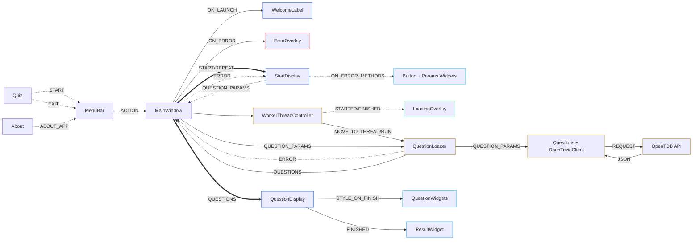

# 🔄 Quiz App - Data Flow

This document shows how data moves through the application. `MainWindow` acts as the central coordinator: it owns the main layout, switches between screens, starts background loading, and routes success or error signals back to the GUI.

## 🚀 Table of Contents
- [🔄 Quiz App - Data Flow](#-quiz-app---data-flow)
  - [🚀 Table of Contents](#-table-of-contents)
  - [🔎 Application Flow](#-application-flow)
  - [📘 Description](#-description)

## 🔎 Application Flow

## 📘 Description
The application data flow is organized around `MainWindow`.

1. `main.py`
   - creates the `QApplication`,
   - configures console and file logging,
   - loads the application stylesheet,
   - creates and displays `MainWindow`.

2. `MainWindow`
   - owns the main stacked layout,
   - creates the menu bar, loading overlay and error overlay,
   - displays the welcome screen and setup screen,
   - coordinates screen changes,
   - creates the question loader and worker thread controller when a quiz starts,
   - routes success and error signals back to the GUI,
   - overrides the built-in `closeEvent` to handle application closing while questions are loading,
   - when a worker thread is running, delays closing, requests the thread to stop, and closes the window after thread cleanup is finished.

3. `StartDisplay`
   - contains `StartButtonWidget` and `QuestionParamsWidget`,
   - reads selected quiz parameters from `QuestionParamsWidget`,
   - emits `start_quiz_requested` with `QuestionParams`,
   - disables `StartButtonWidget` immediately after the start button is clicked to prevent duplicate loading requests,
   - enables `StartButtonWidget` again when `MainWindow` forwards a loading error through `start_error_returned`,
   - resets and marks parameter fields in `QuestionParamsWidget` for `NoQuestionsFoundError` and `NotEnoughQuestionsError`.

4. Question loading
   - `MainWindow` receives `QuestionParams`,
   - creates `QuestionLoader`,
   - creates `WorkerThreadController`,
   - `WorkerThreadController` moves `QuestionLoader` to a background `QThread`,
   - `WorkerThreadController` starts the thread,
   - `MainWindow` shows or hides `LoadingOverlay` based on thread start and finish signals.

5. Data fetching and conversion
   - `QuestionLoader` creates `Questions` with the selected parameters,
   - `QuestionLoader` calls `Questions.load()`,
   - `Questions.load()` calls `OpenTriviaClient`,
   - `OpenTriviaClient` requests data from the OpenTDB API,
   - API response data is converted into `Question` objects,
   - converted questions are stored in `Questions.questions_list`.

6. Question display and scoring
   - `QuestionLoader` emits loaded `Questions`,
   - `MainWindow` creates `QuestionDisplay` with `questions_list`,
   - `QuestionDisplay` creates one `QuestionWidget` per question,
   - user answers are stored in each `QuestionWidget`,
   - after finishing the quiz, `QuestionDisplay` calculates the score,
   - `QuestionDisplay` formats each `QuestionWidget` based on the submitted answer,
   - correctly answered question frames are marked as correct,
   - incorrectly answered question frames are marked as incorrect,
   - answer buttons are styled to show which option contained the correct answer,
   - answer buttons are disabled after the quiz is finished,
   - `ResultWidget` displays the final result,
   - the repeat button emits a signal that returns the app to `StartDisplay`.

7. Error handling
   - API and loading errors are caught by `QuestionLoader`,
   - `QuestionLoader` emits an error signal back to `MainWindow`,
   - `WorkerThreadController` can emit `thread_error` if starting the worker thread fails,
   - `MainWindow` shows `ErrorOverlay`,
   - `MainWindow` forwards the error to `StartDisplay`,
   - for `NoQuestionsFoundError`, `StartDisplay` resets and marks all quiz parameter fields,
   - for `NotEnoughQuestionsError`, `StartDisplay` resets and marks the amount field,
   - generic `OpenTriviaClientError` messages are displayed with a retry hint,
   - unexpected setup errors are logged and shown as a generic user-facing error.
