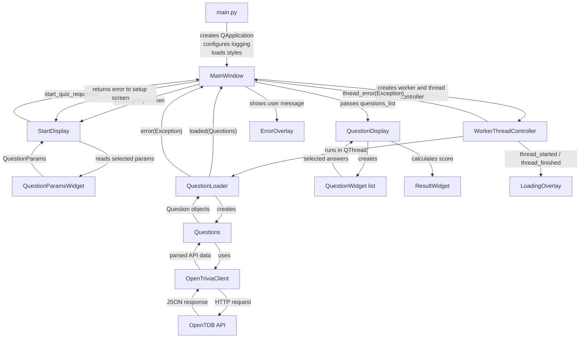

# Quiz App - Data Flow

## Diagram

## Description
The application data flow is organized around `MainWindow`:

1. `main.py`
   - creates the `QApplication`,
   - configures logging,
   - loads the stylesheet,
   - creates and displays `MainWindow`.

2. `MainWindow`
   - owns the main stacked layout,
   - displays the welcome screen and `StartDisplay`,
   - creates loading and error overlays,
   - coordinates question loading and screen changes.

3. `StartDisplay`
   - contains the start button and `QuestionParamsWidget`,
   - reads selected quiz parameters from `QuestionParamsWidget`,
   - emits `start_quiz_requested` with `QuestionParams`.

4. Question loading
   - `MainWindow` receives `QuestionParams`,
   - creates `QuestionLoader`,
   - starts it in a background `QThread` through `WorkerThreadController`,
   - shows `LoadingOverlay` while questions are loading.

5. Data fetching and conversion
   - `QuestionLoader` creates `Questions`,
   - `Questions` calls `OpenTriviaClient`,
   - `OpenTriviaClient` requests data from the OpenTDB API,
   - API response data is converted into `Question` objects.

6. Question display and scoring
   - `QuestionLoader` emits loaded `Questions`,
   - `MainWindow` creates `QuestionDisplay`,
   - `QuestionDisplay` creates one `QuestionWidget` per question,
   - user answers are stored in each `QuestionWidget`,
   - after finishing the quiz, `QuestionDisplay` calculates the score,
   - `ResultWidget` displays the final result.

7. Error handling
   - loading or API errors are emitted back to `MainWindow`,
   - `MainWindow` shows `ErrorOverlay`,
   - `StartDisplay` receives the error and marks or resets invalid parameters when possible.
