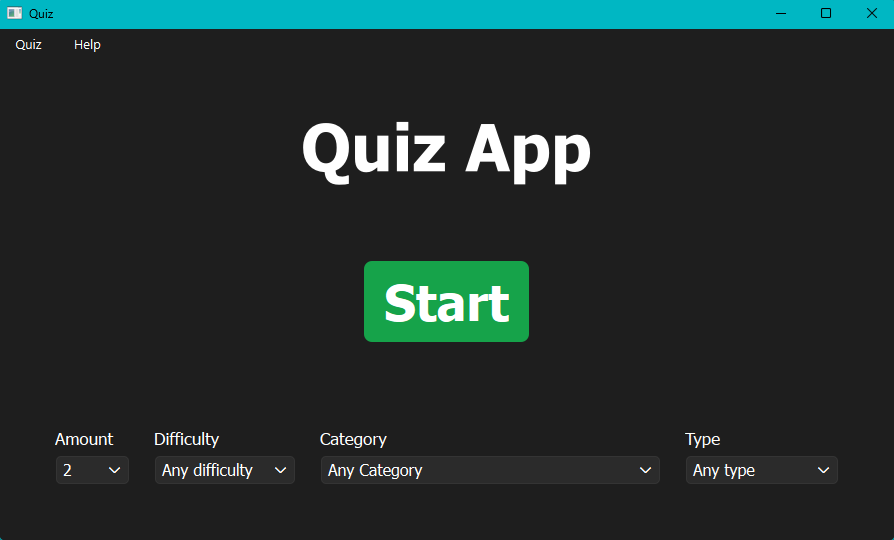
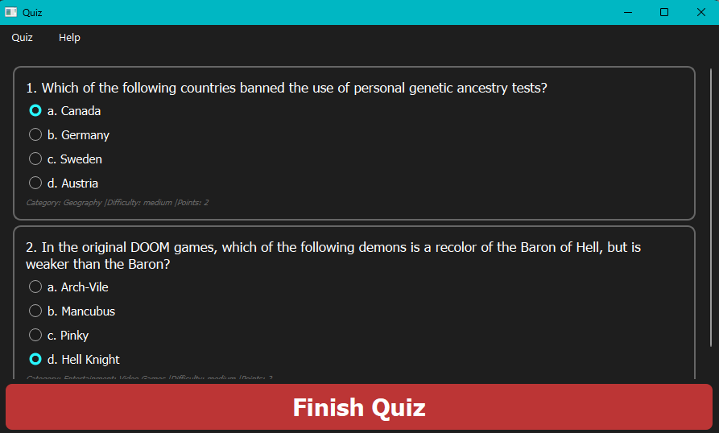
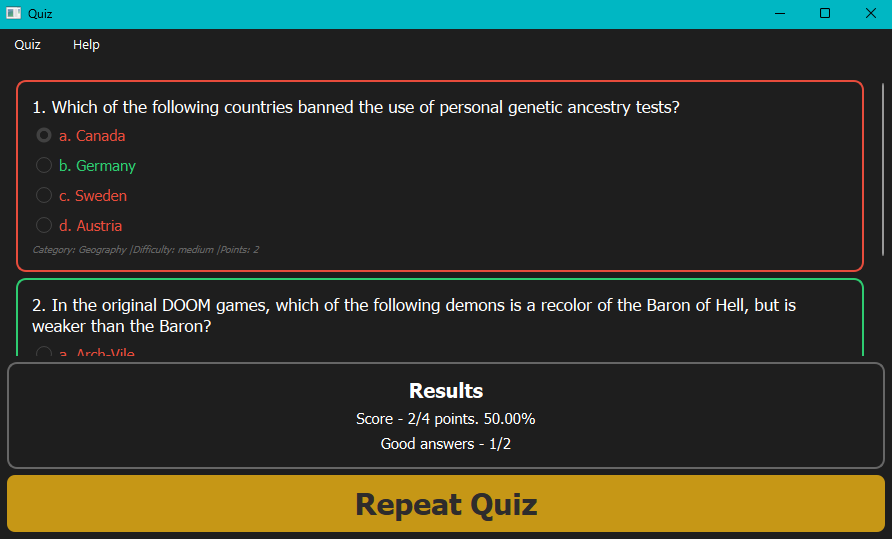
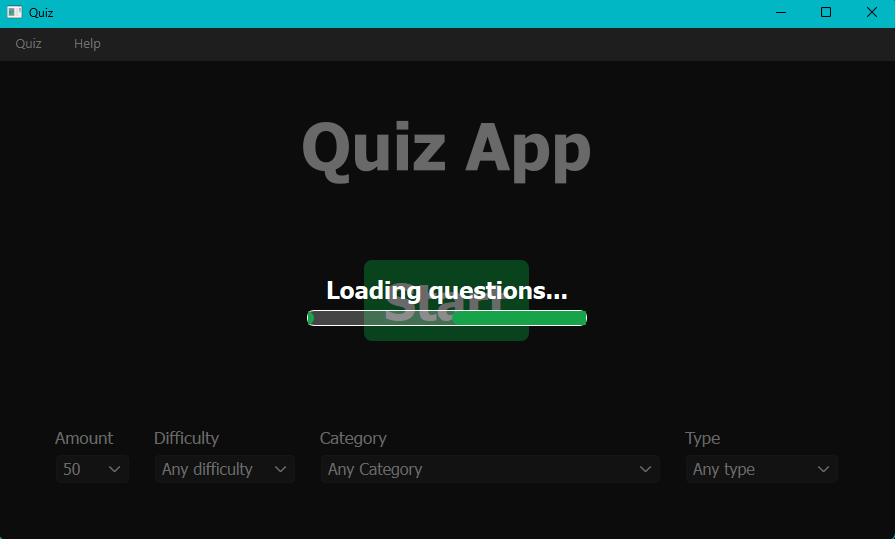
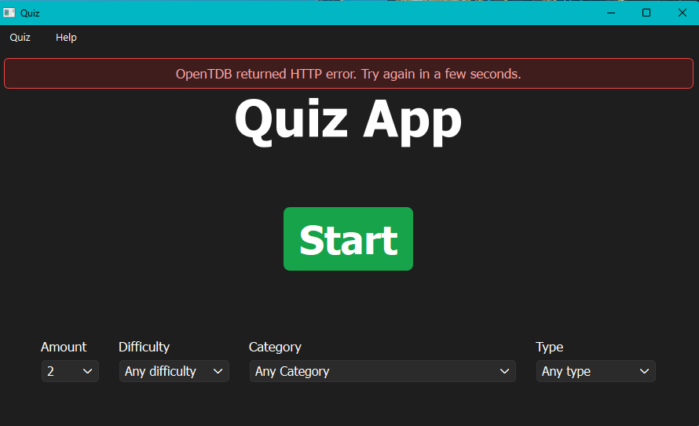
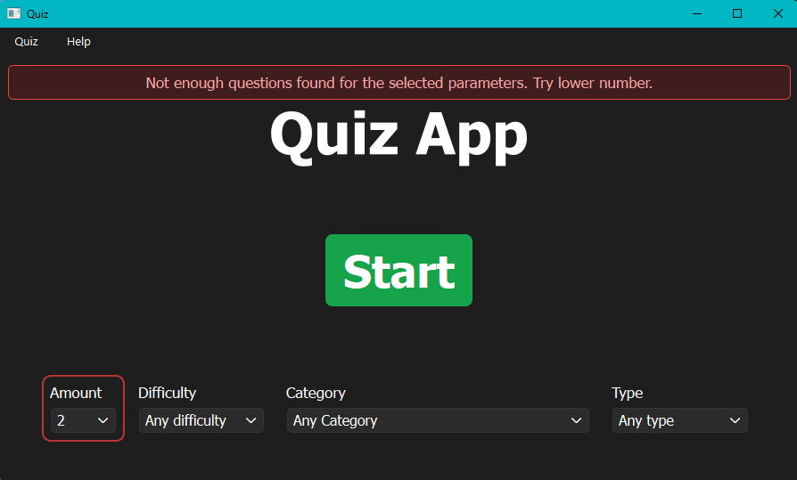
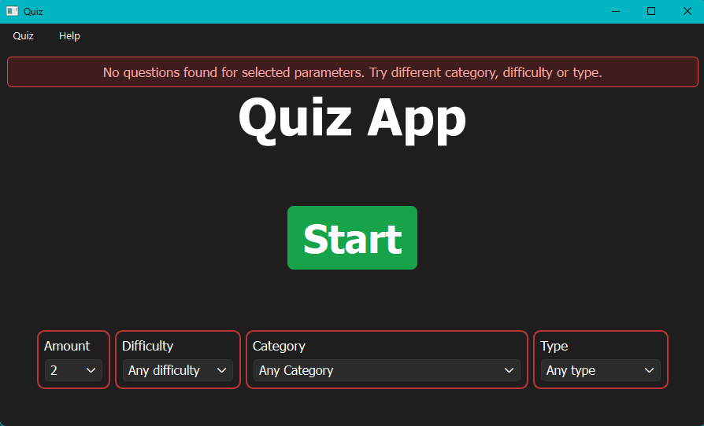

# Widget Presentation
This page shows the main application screens and UI states.

## Start Screen

## Question Screen

## Finished Quiz Screen

## Loading Overlay
Displayed on top of the current screen while questions are being loaded.

## Error States
Error messages are displayed in an overlay on top of the current widget and disappear automatically after a few seconds.

### API Error
Displayed when the OpenTDB request fails or the API returns an HTTP error.

### Not Enough Questions Error
This error also highlights the parameter that caused the issue.

### No Questions Found Error
This error highlights the parameters that caused the issue.

